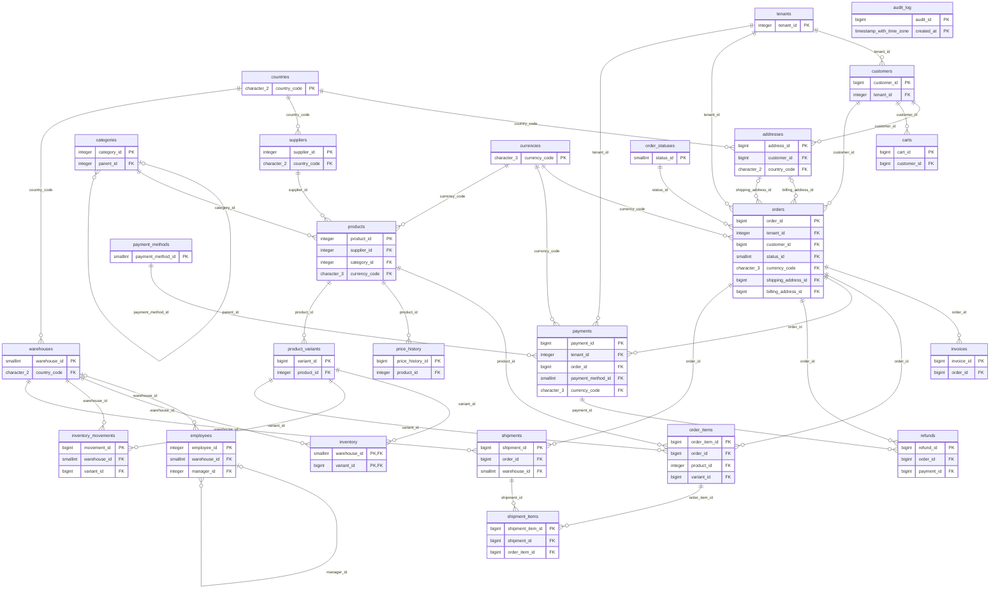

# Entity-relationship diagram

> Generated by `poetry run shopdb docs` from the foreign keys in the live database. Do not edit by hand.
> Only key columns are shown; all columns are in [data-dictionary.md](data-dictionary.md).
> Reading the lines: `A ||--o{ B` means one A has zero or more B; `|o` on the left means the parent is optional (nullable foreign key).

No foreign keys to or from other tables: `audit_log` has none by design (`audit_log` points at rows by table name and id, so the audit trail survives deletes).

