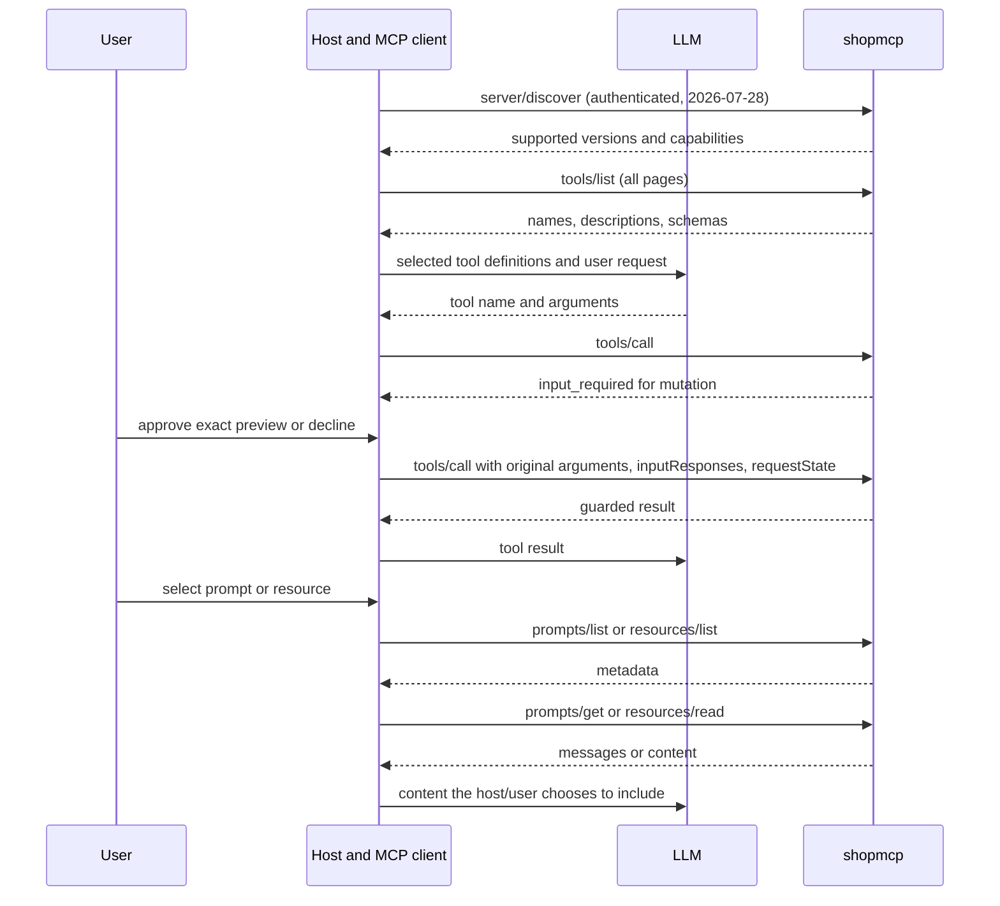

# Discovering tools, resources and prompts

The guarded server exposes **9 tools, 6 resources, 1 resource template and 2 prompts** at
`http://127.0.0.1:8000/mcp`. All MCP requests require authentication. Examples use
the locked FastMCP 4.0.10 SDK; setup is in [guarded-server.md](guarded-server.md).

## How the LLM reaches MCP

The host application owns an MCP client connection. It lists tools and supplies
selected names, descriptions and input schemas to the model. When the model
requests a tool with arguments, the host sends `tools/call` and returns the result
to the model. The model does not open the HTTP connection itself. Discovery does
not execute the tools.
[MCP tools](https://modelcontextprotocol.io/specification/2026-07-28/server/tools).

This repo serves protocol `2026-07-28` only. Requests carry protocol version,
client information and capabilities in `_meta`. `server/discover` advertises the
supported version and capabilities; there is no initialize handshake or session
id. HTTP requests also mirror method and name/URI in `MCP-Method`/`MCP-Name`.
The SDK handles these fields. Inspector must use `protocolEra=modern`.



## Counting the inventory

Send `tools/list`, append the `tools` array, and follow each `nextCursor` by sending
it as `params.cursor`. Count after the final page. Resources and prompts have their
own paginated list methods. There is no need for a custom `list_tools` tool.
[MCP tool discovery](https://modelcontextprotocol.io/specification/2026-07-28/server/tools).

The locked SDK's `list_tools()`, `list_resources()` and `list_prompts()` return lists
and follow pages automatically, with a default maximum of 250 pages. For manual
tool pagination use `list_tools_mcp(cursor=...)`; its result has `.tools` and
`.next_cursor` (wire field `nextCursor`). Reject repeated cursors or unfinished
pagination rather than presenting a partial count as complete. These SDK shapes
were verified against the installed version.

A host may filter tools, discover them on demand or combine servers. Its model may
see fewer tools than this server advertises. To answer the count accurately, the
host must give the model the complete inventory or verified count, identifying the
server and any filtering. The model cannot infer tools hidden by its host.

## Interfaces and bounds

The nine tools remain:

```text
ping, list_tables, describe_table, query, execute, explain,
list_procedures, call_procedure, diagnostics
```

| Resource URI | Name | Content |
|---|---|---|
| `shop://guide/schema` | `schema_guide` | Domains and live catalog inspection instructions. |
| `shop://guide/relationships` | `relationships_guide` | Selected join keys, cardinality cautions and fixture gaps. |
| `shop://policy/sql` | `sql_policy` | Guarded workflows and effective SQL limits for this instance. |
| `ui://shop/query-plan-viewer.html` | `query_plan_viewer` | Bundled MCP App HTML for explain. |
| `skill://investigate-slow-query/SKILL.md` | `investigate-slow-query` | Read-only investigation workflow. |
| `skill://investigate-slow-query/references/checklist.md` | `slow_query_checklist` | Evidence checklist. |

These URIs identify MCP resources, not HTTP endpoints or file paths. The three shop guidance resources return
`text/markdown` with a separate 16,384-byte UTF-8 text budget. The two guides are
shipped revision `guidance-v1`, not database snapshots or a complete ERD. Use
`list_tables` and `describe_table` for current metadata; planner estimates are not
current row counts. The policy reports all nine `Limits` fields from this instance.

`resources/list` returns metadata; `resources/read` fetches content. Listing alone
does not put text into the model's context. The host chooses what to include. The template
`shop://tables/{table}` returns JSON column metadata for one shop table, with
operation_id in response metadata. Names match `[a-z_][a-z0-9_]{0,62}`. No rows
are fetched; resource reads are audited and bounded by result_bytes. Unknown
names and incomplete/truncated metadata produce sanitized resource errors.
There are no resource subscriptions.

All four base discovery catalogs use native cursors, with
`SHOPMCP_LIST_PAGE_SIZE=5` (range 1..100). This does not paginate list_tables tool
results. Completion supports the table template and explore_schema's table
argument: ordered prefix matches, at most 100 values, hasMore when truncated.
Completion lookups use the reader role and are audited.
[MCP resources](https://modelcontextprotocol.io/specification/2026-07-28/server/resources).

| Prompt | Public string arguments | Examples |
|---|---|---|
| `explore_schema` | Optional `table`, default `""` | `{}` or `{"table":"orders"}` |
| `investigate_slow_query` | Required `sql` | `{"sql":"SELECT product_id, name FROM shop.products LIMIT 3"}` |

`prompts/list` discovers templates; `prompts/get` returns one user-role text message.
The host/user chooses whether to use that message. Retrieval does not call the
tools suggested in it or approve a mutation.
[MCP prompts](https://modelcontextprotocol.io/specification/2026-07-28/server/prompts).

`table` must be exactly empty or match `[a-z_][a-z0-9_]{0,62}`. Qualified names,
whitespace and uppercase names are rejected without normalization. Valid syntax
does not establish existence. Exploration prefers metadata; sample rows are only
requested when relevant to the user's request.

`sql` must be nonblank. The original text is preserved in canonical JSON as
untrusted analysis data. Delimiting it is not a prompt-injection security boundary.
The workflow requests a non-ANALYZE plan only for suitable read SQL, passing the
original SQL without adding EXPLAIN. It does not execute the query to measure
latency. Planner cost is not elapsed time, and aggregate diagnostics do not measure
that particular query. Findings separate evidence, likely cause, suggested change
and further verification; proposed changes remain for review.

Each public argument object is limited to `min(limits.request_bytes, 8192)` UTF-8
bytes of canonical JSON, including keys, quotes and escapes. Each complete prompt
message is limited to 65,536 UTF-8 text bytes. Oversized inputs are rejected without
truncation or echoing SQL. Missing SQL, invalid names and unsupported arguments
return useful errors. SQL tools retain their own budgets and enforcement.

## Authenticated FastMCP example

This complete async helper accepts an **already connected, authenticated** client.
Call it inside your existing `async with client:` connection. Configure Auth0 using
the runbook or Inspector; credentials do not belong in this helper. Construct the
client with `mode="2026-07-28"` for this repository.

```python
from fastmcp import Client


async def inspect_guidance(client: Client) -> dict[str, int]:
    tools = await client.list_tools()
    resources = await client.list_resources()
    prompts = await client.list_prompts()
    counts = {
        "tools": len(tools),
        "resources": len(resources),
        "prompts": len(prompts),
    }
    print(counts)
    for resource in resources:
        if not str(resource.uri).startswith("shop://"):
            continue
        contents = await client.read_resource(str(resource.uri))
        for content in contents:
            print(content.mime_type, content.text)
    print("templates:", await client.list_resource_templates())

    requests = [
        ("explore_schema", {}),
        ("explore_schema", {"table": "orders"}),
        (
            "investigate_slow_query",
            {"sql": "SELECT product_id, name FROM shop.products LIMIT 3"},
        ),
    ]
    for name, arguments in requests:
        result = await client.get_prompt(name, arguments)
        for message in result.messages:
            print(message.role, message.content.text)
    return counts
```

Expected count: `{"tools": 9, "resources": 6, "prompts": 2}`. There is one table template.
`read_resource()` returns a list of content objects; `get_prompt()` returns a result
with `.messages`. Printing content does not attach it to a model conversation.

## Authentication, audit and availability

Shared identity middleware authenticates every request independently. Invalid
tokens are rejected on discovery, reads and prompt rendering as well as tools.
MRTR approvals additionally bind caller, exact content and original expiry.

| Operation | Authentication | Database operation audit |
|---|---|---|
| List tools/resources/templates/prompts | Required | No database operation. |
| Read these documentation resources | Required | No database operation. |
| Render these prompts | Required | No database operation; SQL is not persisted by this feature. |
| Read shop://tables/{table} or complete table names | Required | Mandatory intent/outcome audit. |
| Call database tools | Required | Existing intent/outcome audit is mandatory. |
| Call `ping` | Required | Existing database-independent behavior. |

Given a running authenticated server, guidance handlers need no healthy database.
Startup retains its configuration, registry and Auth0 requirements. Live table
resources use the audited catalog service. Guidance cannot bypass policy or
mutation approval; uncertain mutations must never be retried automatically.
Configured tenant context is not a tenant-isolation guarantee. P01-P13 remain
intentional learning problems, not changes for prompts to repair.

## Acceptance evidence

Automated checks use pure renderers, in-process clients with close-only services,
and controlled-JWKS HTTP authentication. Actual commands/counts are in the
[implementation checklist](mcp-resources-prompts-plan.md).

The user confirmed manual resource/prompt acceptance: "I checked, it worked".
This is user-reported client success; per-method UI responses and a negotiated
protocol were not captured. Optional LLM-host resource/prompt context inclusion
remains unverified separately from the required client acceptance.

[Setup-guide Step 18](setup-guide.md#step-18-load-resources-and-prompts-client-acceptance-preflight-2026-10-03)
records the isolated runtime restart and successful HTTP preflight. Computer-use
had no enabled browser surface, so the user performed the manual check. The
updated server was started and the existing Inspector was preserved.


## Explain App, output contracts and Skills

Explain publishes a recursive plan schema with PostgreSQL field aliases and
preserves additional properties. Diagnostics adds data.kind and four report
schemas with documented positional row types, nulls and truncation metadata.
The audit envelope and text JSON remain consistent with structured content.

Explain points to ui://shop/query-plan-viewer.html through _meta.ui.resourceUri.
An Apps-capable host renders a tree with node details, estimates and heuristic
warnings. Selecting a node shares only a short estimates-only context update;
the App never calls SQL tools. Other hosts use the ordinary explain JSON.
The UI declares no external network/resource domains and no privileged permissions.
Rebuild its checked-in viewer.html with npm ci and npm run build in the frontend
folder after changing source; Python builds include that artifact and skill files.

The server advertises io.modelcontextprotocol/skills with directoryRead=false.
Opt-in clients can call skills/list and skills/get. They receive frontmatter and
a complete two-file manifest with raw-byte SHA-256 digests and sizes. File reads
are ordinary authenticated resources/read operations. Reading SKILL.md alone
does not activate a skill; the host verifies the manifest and obtains any required
consent through its skill-loading path. Arbitrary file paths are never resolved.

Modern automated evidence is recorded in setup-guide Step 19. Prior user-reported
manual acceptance above applies to the earlier legacy release. Modern Inspector
Apps rendering and host skill activation require a fresh manual check; they are
not claimed from the historical confirmation.
